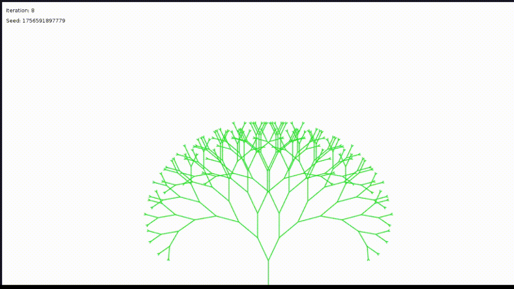

# Fractal

A procedural plant generation system using L-systems (Lindenmayer systems) to create realistic growing plants and trees. Generate diverse plant structures with customizable parameters, stochastic variations, and real-time growth animations.

---

## Quick Start
1. Clone the repository: `git clone https://github.com/hytalo-bassi/Fractal/`
2. Run the application: `./gradlew run`
3. Use keyboard controls to interact:
   - `Space`: Pause/unpause animation
   - `S`: Generate new seed
   - `LEFT/RIGHT arrow`: Switch between different L-systems

## Videos

### Binary Tree (parametric D0L-System)




### Stochastic Binary Tree (parametric L-System stochastic extension)


### Simple Plant (The first L-System implemented)


## Features

- Multiple L-system implementations (D0L, stochastic)
- Real-time interactive controls
- Seed-based procedural generation
- Anti-aliased rendering
- Parametric plant modeling

## What's that about?

L-systems are parallel rewriting systems used to model the growth processes of plants. This project implements various L-system algorithms to generate realistic plant structures.

The used algorithms are usually explained better at [docs/](docs).

## How to Use

This project uses **Gradle** as its build system. Here are the most common commands:

### Running the Project
```bash
# Run the application
./gradlew run

# Run tests
./gradlew test

# Check code formatting
./gradlew spotlessCheck

# Fix code formatting automatically
./gradlew spotlessApply
```

## Contributing

Contributions are welcome! Please read below:

### Coding Conventions

We want our codebase to be readable, consistent, and maintainable. Please follow these guidelines:

#### Code Style

- Prioritize readability over clever tricks.

- Write easy-to-follow logic.

- Strive for optimized but clear code.

- Use English for all variable names, class names, and methods.

- Write comments only when necessary (the code should explain itself).

#### Git Conventions

Follow Conventional Commits:
- `feat`: – new feature
- `fix`: – bug fixes
- `docs`: – documentation changes
- `style`: – formatting changes (no code logic impact)
- `refactor`: – code refactoring
- `test`: – adding or updating tests
- `chore`: – maintenance tasks

Example:
```
feat: add support for interpreting parameters in L-system strings

The L-system interpreter can now parse and evaluate parameters embedded
in the production rules (e.g., F(10), A(theta)). This enables more
flexible modeling of growth patterns and parameterized plant structures.
```

Also remember to:
- Keep commits small and focused.
- Use clear commit messages that describe what and why, not just how.

## Roadmap

**In Development**

**Planned**

- Realistic trunk and branches random radius.
- (Almost) Random leaves shapes
- Realistic (possibly multiple) colors to the wood and leaves. 

**Under consideration**

- Implementation of context-sensitive L-Systems
- Generalization of types of trees (monopodial, sympodial, pleionomorphic and etc) in a range of L-systems (maybe it's not possible).

**Recently Completed**
- Stochastic Binary Trees
- Antialiasing
- Seed generation
- Keyboard controls (change L-system, update seed, pause and unpause animation)
